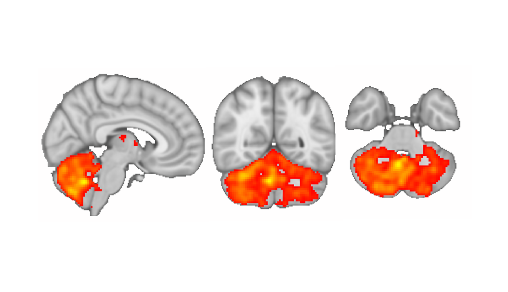

# oxford_rs_analysis
#### Code to perform network analysis on resting-state fMRI data written as part of my DPhil studies in Oxford 2016-2020

## Usage
1. Start by looking through the analyse_rs.sh script.
   
   - This script lists all necessary steps for pre-processing the resting-state data (betting, registration, cleaning, etc.) and conducting statistical analysis on the derived networks with randomise.
   - Depending on the requirements of your data and the recommendations for your sequence parameters, some scripts will likely need some tweaking.
  
2. Work your way through the steps in analyse_rs.sh by tweaking the parameters and checking your output as you go along.
   
   - For each step, there are scripts provided with which you can check your processed output and inspect the results.
   - Adjust the visualisation parameters according to the requirements of your data (e.g. the fsleyes display range flag -dr is ideally set to 0 300 for the T1-weighted images and 0 3000 for T2*-weighted images in my dataset, check out the [fsleyes documentation][2]).    
      
    > Note: Turning off slice-timing correction seems to be an issue for FIX, even if the TR is very low (which is when some people recommend turning off slice timing corrections and just using temporal derivatives). Turning it off resulted in FIX not being able to detect multiband artefacts as noise and led to many multiband artefacts in the group-level components.

    > Tip for cerebellar enthusiasts: Be careful with the -m flag when FIX-cleaning. In my experience this massively reduces cerebellar contribution to group networks, potentially because the hand-labelled FIX training data did not include cerebellar regions and therefore wrongly labels most of cerebellar components as noise. If you care about cerebellar signal (which everyone should of course :P), then take caution with using that flag. Try running FIX with and without the flag and compare the group-level components, especially in inferior areas.
  
3. There are additional scripts with which you can analyse resting-state networks further, for example to relate network strength to behavioural change or neurochemical data. These are not listed in the master script (analyse_rs.sh) script, so have a look through the repository.

If any script throws an error, check your inputs and outputs first. Then have a look at [FSL documentation][4] and search for your error message in the [FSL mailing list archives][1]. If any scripts are missing, you get a persistent error or you want to talk to me about your results, feel free to [email me][3].

[1]: <https://www.jiscmail.ac.uk/cgi-bin/webadmin?A0=fsl> "FSL mailing list archive"

[2]: <https://users.fmrib.ox.ac.uk/~paulmc/fsleyes/userdoc/latest/> "FSLeyes documentation"

[3]: <mailto:crn29@cam.ac.uk> "What's up Caro"

[4]: <https://fsl.fmrib.ox.ac.uk/fsl/fslwiki/> "FSL documentation"

**Happy analysing!**

*Figure 1. The magnificent cerebellar network in the wild.*

